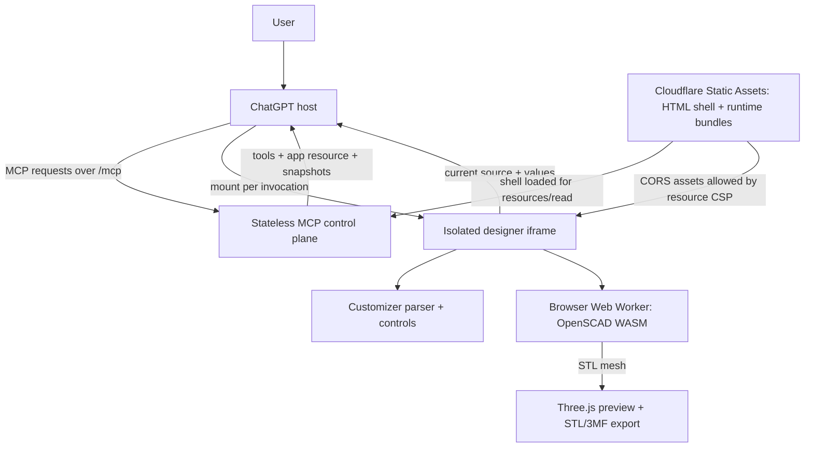

# OpenSCAD Designer architecture

Status: browser-rendered MVP running on a Cloudflare preview; live ChatGPT validation remains pending.

## Executive summary

OpenSCAD Designer is intentionally a browser-rendered ChatGPT app, not a hosted CAD service. ChatGPT talks to a small MCP control plane. The control plane advertises tools, validates complete design snapshots, and serves the app resource. Each mounted app iframe owns its source, parameter values, rendered mesh, and OpenSCAD WebAssembly worker.

ChatGPT supplies the intelligence and model runtime. Our deployment does not call the OpenAI API and does not need an OpenAI API key. Cloudflare supplies only the protocol and asset edge; the user’s browser supplies CAD compute.

This architecture supports many independent users once it is deployed: every user receives an isolated iframe and every MCP request receives a fresh stateless server instance. Shared documents, membership, permissions, presence, and real-time co-editing are explicitly outside the product scope. Personal persistence is not currently implemented and would not change that boundary.

| Meaning of “multi-user” | Current position |
| --- | --- |
| Many people independently use the public app | Live preview available; concurrency and production load testing remain pending |
| Two people edit the same design together | Explicitly out of scope |
| A person returns to saved projects later | Not implemented; files are currently downloaded by the user |

## Runtime overview

Cloudflare packages and delivers the app resource but does not evaluate OpenSCAD. The first hosted version keeps CAD compute inside the browser unless a live ChatGPT sandbox test proves that impossible.

## Component responsibilities

### ChatGPT host

- Uses the model to create and revise OpenSCAD source.
- Discovers and calls tools exposed by the remote MCP endpoint.
- Fetches and mounts the associated MCP App resource in an iframe.
- Receives `ui/update-model-context` snapshots after the user edits source or parameters.
- Mediates supported file-download and display-mode operations.

### MCP control plane

The MCP server is the protocol adapter between ChatGPT and the frontend. A standalone browser application would not need it; a ChatGPT app needs it for tool discovery, typed tool calls, UI-resource delivery, and model/UI synchronization.

The current server creates a fresh MCP server and transport for every HTTP POST. It stores no design state, runs no OpenSCAD process, and creates no mesh. Every relevant call carries a complete snapshot. Every tool explicitly advertises the Apps SDK `noauth` security scheme in both the canonical tool descriptor field and its `_meta` compatibility mirror; the app has no account-linking or OAuth flow because it consumes no user identity or private backend data.

| Tool | Purpose | What the server actually does |
| --- | --- | --- |
| `open_design` | Open arbitrary `.scad` source in the designer | Validates and returns the initial snapshot; tool metadata attaches the shared UI resource |
| `update_design` | Replace the current source | Validates and returns the complete replacement snapshot |
| `configure_design` | Apply Customizer values | Round-trips source, schema, and all current values |
| `export_design` | Request SCAD, STL, or 3MF export | Returns an export instruction; the iframe creates the file |

These tools are intentionally coarse. They give the model semantic actions while keeping browser state visible to the next model turn. They are not remote OpenSCAD commands.

The current iframe calls `configure_design` after debounced edits and then updates model context. Because `configure_design` only echoes the snapshot, this is a deliberate contract prototype rather than an efficient final sync path. Before public deployment we should test direct debounced `ui/update-model-context` from the iframe and retain `configure_design` only for model-driven parameter changes. That avoids repeatedly sending the complete source through a redundant tool round trip.

### Designer iframe

- Parses OpenSCAD Customizer annotations and generates grouped form controls.
- Owns the active source and values while mounted.
- Debounces local rendering and snapshot synchronization.
- Displays the actual STL through Three.js orbit controls.
- Packages rendered STL geometry into a basic millimeter-scale 3MF.
- Downloads `.scad`, `.stl`, and `.3mf` artifacts without first uploading them to our infrastructure.

### OpenSCAD browser worker

The iframe starts an isolated Web Worker containing `openscad-wasm-prebuilt`. The worker appends validated parameter assignments to the source, invokes the real OpenSCAD evaluator, and transfers the resulting STL buffer back to the iframe. A new worker is used for each render so a cancelled or failed Emscripten runtime cannot poison later renders.

“Arbitrary SCAD source” currently means self-contained source supported by this WASM build. There is no project-bundle or virtual-filesystem contract for `include`, `use`, imported STL/SVG/DXF files, textures, or user-provided fonts. Those dependencies require an explicit file workflow before we can claim support.

### Cloudflare deployment

The hosted shape is:

- A small Cloudflare Worker exposing `/mcp` with a request-scoped Streamable HTTP handler and `/health` for readiness checks.
- Workers Static Assets holding a small app shell plus the large OpenSCAD runtime bundle, outside the Worker script. The MCP response rewrites the shell to the current deployment origin and allowlists that exact origin in the resource CSP.
- Pull-request versions with preview aliases, followed by a stable production Worker URL for publication.
- GitHub Actions as the only publishing path, with separate `preview` and `production` GitHub Environments.

The MCP registrations are runtime-neutral. The Node `IncomingMessage` adapter embeds the same generated UI for local development, while the Worker loads it lazily through the `ASSETS` binding. Both create a fresh server per request and retain no design snapshots.

Cloudflare credentials are environment-scoped in GitHub rather than stored in the repository. Preview and production use the same Worker: pull requests upload aliased versions without changing production traffic, while only `main` creates a production deployment. Same-repository, non-draft pull requests may enter the credential-bearing preview job after any configured environment approval; fork pull requests never do. See the [deployment guide](deployment.md).

## State and data lifecycle

| Data | Current owner | Persistence |
| --- | --- | --- |
| OpenSCAD source | Tool snapshot, iframe, then model context | Conversation context only; user can download `.scad` |
| Customizer values | Tool snapshot and iframe | Conversation context only |
| STL mesh | Iframe memory | Until iframe teardown; user can download STL |
| 3MF package | Created in iframe on demand | Download only |
| User identity | ChatGPT host | Not consumed by this app |
| Project history | None | Not implemented |

The MCP server can therefore scale horizontally without sticky sessions. There is no cross-user cache or singleton containing user data. The built HTML/WASM assets are shared and immutable; design data is not.

## Why not render on the backend now?

Browser rendering has useful product and privacy properties:

- Rendered meshes do not need to be uploaded to our infrastructure; source only transits through the stateless tool snapshots needed for model/UI synchronization.
- Rendering capacity scales with users instead of consuming centralized compute.
- There are no queues, render workers, file stores, cleanup jobs, or per-render infrastructure costs.
- The same code can also run as a standalone local web app.

A backend renderer becomes justified if the developer-mode spike establishes one or more of these conditions:

1. ChatGPT’s iframe policy blocks the WASM module or module worker.
2. The runtime cannot be packaged within acceptable resource and startup limits.
3. Representative models exceed browser memory or latency budgets.
4. Required fonts, imports, libraries, or filesystem features cannot be supplied safely in-browser.
5. We require authoritative server-side validation, thumbnail generation, batch jobs, or persistent artifact URLs.

If that gate is crossed, OpenSCAD should run in an isolated, resource-limited container service rather than inside the lightweight MCP Worker. The MCP layer would enqueue or proxy render jobs and return artifact references. That is a fallback architecture, not an MVP prerequisite.

## Independent-user isolation

Independent use requires no shared application state. Each invocation is naturally isolated by the ChatGPT iframe and the request-scoped MCP server. Production hardening still needs request limits, rate limiting, telemetry, and concurrency testing.

Shared collaboration is not a future product track. The architecture must not add shared project membership, collaborative permissions, presence, live synchronization, CRDTs, or shared-session infrastructure. A future personal persistence feature, if requested, should retain single-user ownership and the same cross-user isolation boundary.

## Security and reliability boundaries

- Treat all tool input and OpenSCAD source as untrusted.
- Keep evaluation off the MCP control-plane isolate.
- Add source-size, render-time, memory, triangle-count, and diagnostic-output limits before broad distribution.
- Preserve cancellation so rapid parameter changes terminate superseded workers.
- Declare exact CSP resource origins and a unique widget domain before publication.
- Do not claim a model is printable merely because OpenSCAD produced a mesh; dimensional and mechanical validation remain the user’s responsibility.
- Do not generate G-code. Slicer profiles, orientation, supports, and printer control remain downstream.

## Architecture decisions

1. **Browser-first rendering:** keep the real OpenSCAD evaluator in an iframe Web Worker for the first hosted spike.
2. **Stateless MCP snapshots:** every tool call carries the complete current design state.
3. **No persistence in v1:** source and meshes stay client-side unless the user downloads them.
4. **No shared editing:** collaboration is an explicit product non-goal; concurrency means isolated independent users.
5. **Cloudflare as the first deployment target:** use a Worker for MCP and Static Assets for the large runtime, published only through GitHub Actions.
6. **Backend rendering is gated by evidence:** introduce it only after a sandbox, feature, or performance failure demonstrates the need.
7. **Anonymous tool access:** declare `securitySchemes: [{ type: "noauth" }]` on every tool; add OAuth only if a future feature accesses private user data or a protected backend.

## References

- [OpenAI: deploy an Apps SDK app](https://developers.openai.com/apps-sdk/deploy)
- [OpenAI: build the ChatGPT UI](https://developers.openai.com/apps-sdk/build/chatgpt-ui)
- [OpenAI: authenticate Apps SDK users](https://developers.openai.com/apps-sdk/build/auth)
- [Cloudflare: build an interactive ChatGPT app](https://developers.cloudflare.com/workers/demos/chatgpt-app/)
- [Cloudflare: build a remote MCP server](https://developers.cloudflare.com/agents/model-context-protocol/guides/remote-mcp-server/)
- [Cloudflare Workers limits](https://developers.cloudflare.com/workers/platform/limits/)
